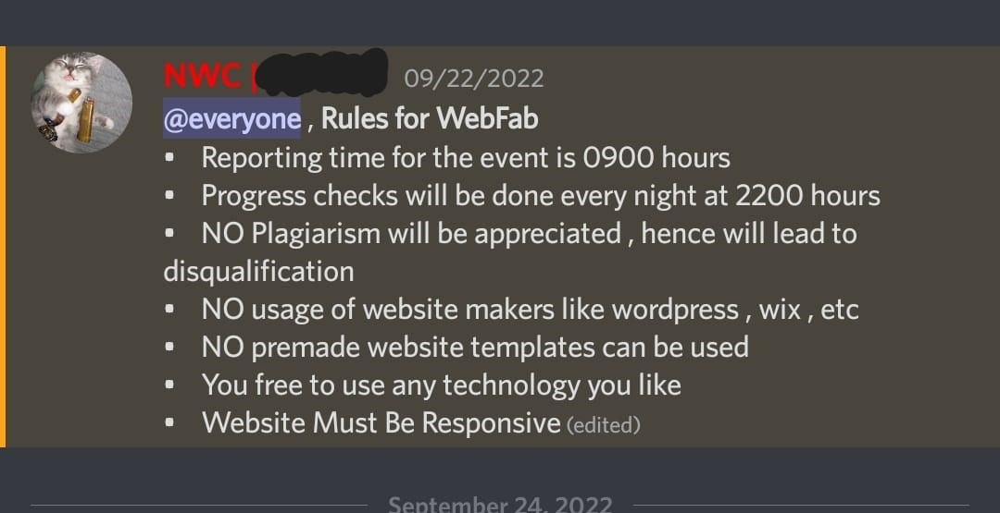

# Disqualified 😢

I was disqualified from this hackathon. Apparently using Mantine was not allowed, but they didn't specify anything before the hackathon. Below is a screenshot of the rules provided to us:



Apparently Mantine comes under

> premade website templates

They even said Bootstrap comes under premade website templates.

I completely disagree with this, Mantine/Bootstrap and other component libraries do not count as premade website templates. There is a huge difference between piecing together styled components in the way you want and just editing a prebuilt template.

I built this website by myself from scratch. Unfortunately, the rules weren't clear enough.

If the rules were specified clearly before, I would have built the website using custom CSS.

Waste of my time. Never going to attend any of their events ever again.

## 9xDeveloper - WebFab 2022

[View the website](https://webfab-2022-frontend.vercel.app/)

This repository was my submission for the WebFab 2022 hackathon conducted by [NWC Association SRMIST](https://www.instagram.com/nwcsrmist/) and [IoT Alliance SRM](https://www.instagram.com/iotalliance.srm/).

## Hackathon Theme

Build a website for NWC Association.

[Assets](./assets) to get started.

## Technologies used

- [Next.js](https://nextjs.org/)
- [Mantine UI](https://mantine.dev/)

## Installation

1. Clone this repository

   ```sh
   git clone https://github.com/DEEJ4Y/webfab-2022.git
   ```

2. Go to the root of this project

   ```sh
   cd webfab-2022/
   ```

3. Install the dependencies

   ```sh
   npm install
   ```

4. Start the development server

   ```sh
   npm run dev
   ```

5. Head over to [http://localhost:3000/](http://localhost:3000/) and start making changes.

## Building for production

Before you start, make sure to close any open next.js servers for this project.

1. Run the build script

   ```sh
   npm run build
   ```

2. Test out the build

   ```sh
   npm start
   ```

3. Head over to [http://localhost:3000/](http://localhost:3000/) to check out the build.

## Updating data

All the team members and activities data is stored in the `📁assets/` folder.

### Team members `📁assets/team.js`

Each team member has an object of the follwing shape:

```js
{
  name: "",             // Name of the member
  imgUrl: "",           // URL for the member's image
  department: "",       // Department/Domain of the member
  role: "",             // Member's position in the association
  bio: "",              // Bio of the member
  linkedin: "",         // URL for the member's Linkedin page
  personalWebsite: "",  // Personal URL that a member wants to share
  github: "",           // Github profile of the member
  group: "",            // Optional. Group that the member belongs to in the organizational heirarchy.
},
```

The team object has the following shape:

```js
const team = {
  facultyHeads: [
    // team member object 1
    // team member object 2
    // ...
  ],
  boardMembers: [
    // ...
  ],
  domainHeads: [
    // ...
  ],
  members: {
    events: [
      // ...
    ],
    creatives: [
      // ...
    ],
    technical: [
      // ...
    ],
    finance: [
      // ...
    ],
    sponsorship: [
      // ...
    ],
  },
};
```

#### Managing team members

- Adding a team member: To add a new team member, create a new team member object, fill in the fields, and add it to the team object in the desired location.
- Editing a team member: To edit an existing team member, simply edit the existing team member object.
- Deleting a team member: To delete an existing team member, remove the object from the array.

### Activities `📁assets/activities.js`

Activities is an array of instagram post URLs. At any point in time, the top 9 activities are displayed on the activities page.

```js
const activities = [
  // post url 1
  // post url 2
  // ...
];
```

#### Managing activities

- Add a post: Add the new post URL as a string to the top of the activities array.
- Delete a post: Remove the post URL from the array.
